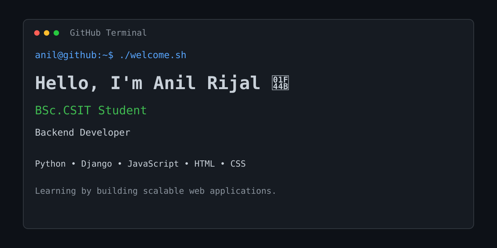

	
	 
	

<table align="center">
	<tr>
		<td width="50%" valign="top">
			<h2>👋 Anil Rijal</h2>
			
<strong>Python & Django Developer</strong>

			
CSIT student building practical web applications with Python, Django, PostgreSQL, and modern web technologies.

		</td>
		<td width="50%" valign="top">
			<h2>🛠 Tech Stack</h2>
			
<strong>Backend:</strong> Python · Django · REST APIs

			
<strong>Frontend:</strong> JavaScript · HTML · CSS · Bootstrap

			
<strong>Data & Tools:</strong> PostgreSQL · SQLite · Git · Vercel

		</td>
	</tr>
</table>

<table align="center">
	<tr>
		<td width="33%" valign="top">
			<h3>📌 Now Building</h3>
			
Hospital management workflows with a focus on clear data models and practical user flows.

		</td>
		<td width="33%" valign="top">
			<h3>⚙️ How I Work</h3>
			
Understand the problem, design the simplest useful solution, then iterate from real feedback.

		</td>
		<td width="33%" valign="top">
			<h3>🟢 Available</h3>
			
Open to backend projects, learning opportunities, and thoughtful collaborations.

		</td>
	</tr>
</table>

<h2 align="center">🚀 Featured Projects</h2>

<table align="center">
	<tr>
		<td width="33%" valign="top">
			<h3>🎬 NepFlix</h3>
			
Django movie ticket booking platform with seat booking, reviews, payments, memberships, refunds, and analytics.

			
<strong>Python · Django · JavaScript</strong>

		</td>
		<td width="33%" valign="top">
			<h3>📸 Photography Portfolio</h3>
			
Responsive photography portfolio with PWA support, themes, animations, and project showcases.

			
<strong>HTML · CSS · JavaScript</strong>

		</td>
		<td width="33%" valign="top">
			<h3>📚 CSIT GOD</h3>
			
Academic resource platform for organizing CSIT learning materials and study resources.

			
<strong>Python · Django · JavaScript</strong>

		</td>
	</tr>
</table>

<table align="center">
	<tr>
		<td width="50%" valign="top">
			<h2>📊 Currently Learning</h2>
			
Flutter · PostgreSQL · Backend architecture · Production deployment

		</td>
		<td width="50%" valign="top">
			<h2>🔗 Connect</h2>
			
<a href="https://anilrijal.info.np">Portfolio</a> · <a href="https://github.com/Anil702429">GitHub</a>

		</td>
	</tr>
</table>

<em>Build it. Break it. Understand it. Improve it.</em>

